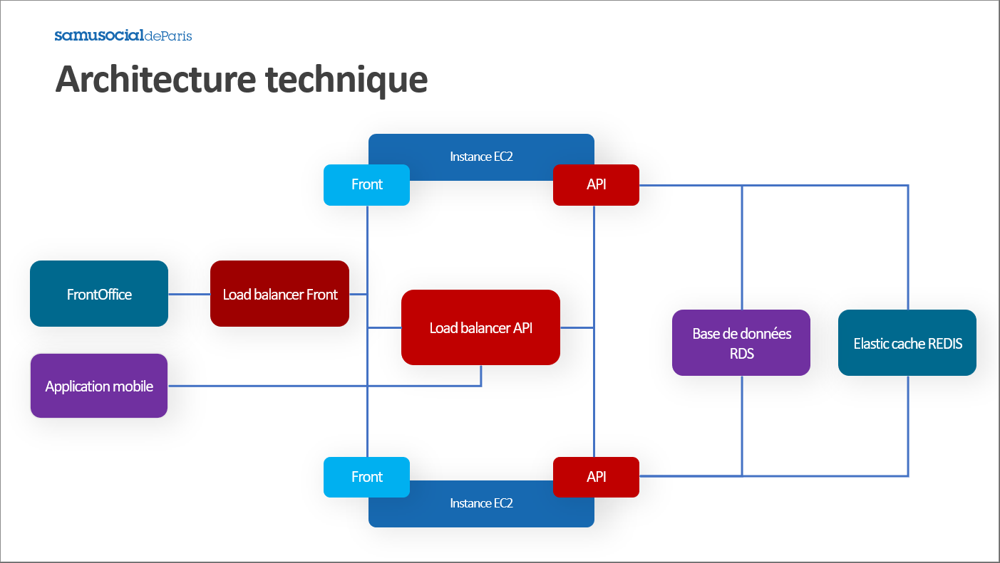

# Devops & Install repo

### Description

This repo is the devops and the entrypoint for the SSDP project.



#### Ressources
* [Front](http://production-app-elb-1614856992.eu-west-2.elb.amazonaws.com/)   
  * Identifiants de connexions:
    * username: eric.salarie-1@ssdp.net
    * password: 1234

* [API](http://production-app-api-elb-804589129.eu-west-2.elb.amazonaws.com/api)   
* [API documentation](http://production-app-api-elb-804589129.eu-west-2.elb.amazonaws.com/documentation)

### Guide d'installation de l'environnement de développement 

- Cloner le repo `git clone git@github.com:ten4ssdp/devops.git ssdp`
- Dupliquer le fichier `.env.example` et le renommer en `.env` et remplir les variables d'environnements du fichier.
- Lancer le script `./install.sh`

### Informations complémentaires

[Cliquez-ici pour accéder au Notion du projet](https://www.notion.so/Groupe-10-657ad39759404d0ea9f6217de1690b5e)

### Collaborateurs sur la partie DevOps

* [Kevin MANSSAT](https://github.com/Rayzors)
* [Paartheepan RAVEENTHIRAN](https://github.com/punkte)

### Déployer l'architecture

La plateforme utilisée pour lancer une instance est celle d'Amazon AWS.  
Pour l'ensemble des composantes de l'application avec Terraform il faut :
* Avoir le CLI Terraform d'installé
* Avoir un compte AWS
* Ajouter un groupe dans l'onglet Gestion des identités et des accès (IAM)
  * IAM > Groupe > Créer un groupe
  * Définir la stratégie attachée AmazonEC2FullAccess
  * Définir la statégie attachée AmazonElastiCacheFullAccess
* Ajouter un utilisateur au groupe crée
  * IAM > Users > Créer un utilisateur
  * Puis l'assigner au groupe crée
  * Récupérer l'ID de clé d'accès et la clé d'accès secrète

#### Définir les variables récupérées à l'étape précédente 

```bash
$ export AWS_ACCESS_KEY_ID="l'id de clé d'accès ici"
$ export AWS_SECRET_ACCESS_KEY="la clé d'accès"
```

#### Initialiser Terraform

Copier le contenu du fichier [sensitive.tfvars.example](./terraform/sensitive.tfvars.example) dans un fichier nommé `sensitive.tfvars` placé au même endroit.  
Les variables à définir sont les suivantes :  
```
dbusername        # identifiant de la base de donnée 
dbpassword        # mot de passe de la base de donnée
```

```bash
$ terraform init
```
#### Vérifier les actions qui vont être effectuées

```bash
$ terraform plan -var-file="sensitive.tfvars"
```
#### Lancer les instances
```bash
$ terraform apply -var-file="sensitive.tfvars"
```

### Lancer le playbook ansible sur l'instance créée

Définir les variables suivantes dans les [group_vars](./ansible/inventory/group_vars/tag_stage_production/vault.yml)
```
site_project_name       # nom du projet
site_api_port           # port de l'api
site_front_port         # port du front
site_db_port            # port de la base de données
site_db_name            # nom de la base de données
site_db_username        # identifiant de la base de donnée (le même que celui qui a été défini dans la partie terraform au lancement de la bdd)
site_db_password        # mot de passe de la base de donnée (le même que celui qui a été défini dans la partie terraform au lancement de la bdd)
site_jwtsecret          # mot de passe jwt
site_api_base_url       # IP de l'instance lancée (au format http://hostname.ext)
site_gmail_address      # Adresse Gmail
site_gmail_password     # mot de passe Gmail
```


Ansible se charge de récupérer les inventory de manière dynamique grâce au fichier `ec2.py`.  
Pour lancer le playbook de déploiement la commande est la suivante :

```bash
$ ansible-playbook ./ansible/deploy.yml -i ./ansible/inventory/ec2.py --ask-vault-pass  --key ~/.ssh/hetic_rsa -u ubuntu --extra-vars "app=all"
```
La valeur du dernier paramètre `app` peut prendre les valeurs suivantes :
  * `all` : pour construire les images du back et du front (qui est la valeur par défaut)
  * `front` : pour construire les images du [front](https://github.com/ten4ssdp/front-office)
  * `back` : pour construire les images du [back](https://github.com/ten4ssdp/planning-api)


### Déploiement et intégration continue

Par défaut les playbooks sont lancés lorsque la branche `master` de chacun des 2 projets est mise à jour.  
Nous utilisons Github Actions pour pouvoir lancer le playbook de déploiement.  

Une intégration continue a aussi été mise en place sur le [repo back](https://github.com/ten4ssdp/planning-api).  
Le code est linté et des tests unitaires sont lancés à chaque push & pull_request sur toutes les branches.

### Roles

* Docker => Installe docker sur le server
* Pip => Installe python sur le server
* Sites => Installe les modules python docker , docker-compose sur le server puis lance les containers


